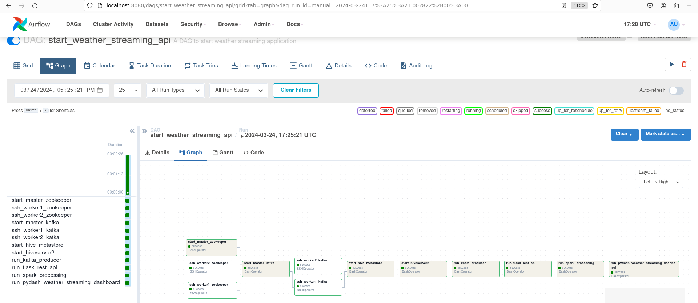
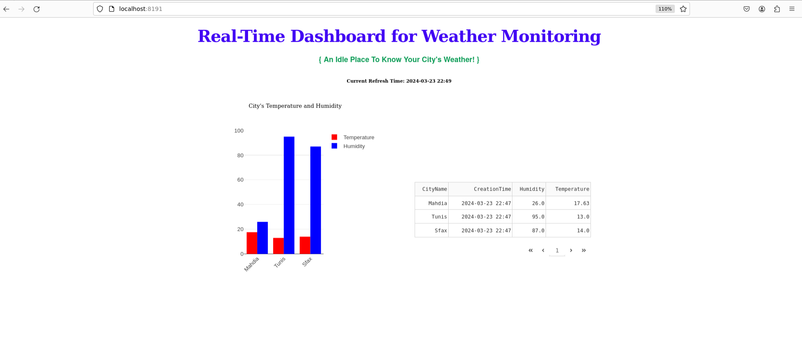

# Real-Time Weather Monitoring Application

## Overview
This project is a real-time weather monitoring application that collects weather data from various cities in Tunisia (Tunis, Sfax, Mahdia) and streams it to Kafka topics. It includes components for data collection, processing, and visualization.

## Description
The project aims to:
- Collect real-time weather data from multiple locations using the Tomorrow.io API.
- Stream weather data to Kafka topics for real-time processing.
- Use Apache Spark for processing and analyzing the weather data.
- Provide a RESTful API for accessing weather data using Flask RestX.
- Display a real-time weather dashboard using Dash and Plotly.

## Pipeline
Here you can find a detailed overview of our application pipeline:
 
 

   
    
  

## Prerequisites

In order to run this projet you need to have: 

<ul>
 <li>
   3 or more working virtual machines with linux os installed on each one of them (i used lubuntu os).  
  </li>
 <li>
   Fully configured and installed hadoop in cluster mode (i used hadoop 3.3.4).  
   </li>
   <li>
   Apache Spark installed on top of hadoop (i used spark 3.4.1).  
     </li>
     <li>
    Fully configured and installed Apache Kafka in cluster mode (i used kafka 3.6.1).  
     </li>
    <li>
    Apache Hive installed (i used hive 3.1.3).  
     </li>
      <li>
    Apache Airflow installed (version >=2.0.0).  
     </li>
   <li>
   Python 3 or later installed.  
     </li>
     <li>
   Java 8 installed (it's the only java version supported by hive).  
     </li>
 </ul>

## Setup and Usage
To set up the project locally, follow these steps:  

1) Clone the repository:
   > git clone <https://github.com/Znullptr/WeatherStreamingSpark>

2) Install dependencies:
   > pip install -r requirements.txt
   
3) Start your hadoop cluster.
   
4) start hive and create weather table using this command(modify location to match your hdfs environment):
   > CREATE EXTERNAL TABLE weather_details_tb1 ( 
    CityName STRING,
    Temperature DOUBLE,
    Humidity DOUBLE,
    RainIntensity INTEGER,
    WindSpeed DOUBLE,
    WindDirection DOUBLE,
    CreationTime TIMESTAMP)
    ROW FORMAT DELIMITED
    FIELDS TERMINATED BY ','
    STORED AS TEXTFILE 
    LOCATION '/user/hadoop/outputs/spark_outputs/weatherstreaming/data';
   
5) Create and configure your systemd unit files for each service required by the application.
   
6) Copy **weather_streaming_dag.py** to your dags floder and start your apache airflow server.
   
7) Open airflow interface you should see the dag imported and you can execute it.
   

    
   

8) Once it's successfully completed, you should see the application dashboard listening on port 8191:
     

      
       
  

## Contributing
Contributions are welcome! Please open an issue or submit a pull request with any improvements or bug fixes.

## License
This project is licensed under the MIT License - see the [LICENSE](LICENSE) file for details.

## Acknowledgements
- Tomorrow.io for providing weather data APIs.
- Apache Kafka and Apache Spark for data ingestion and data processing.
- Flask for building the API and dash for dashboard.
